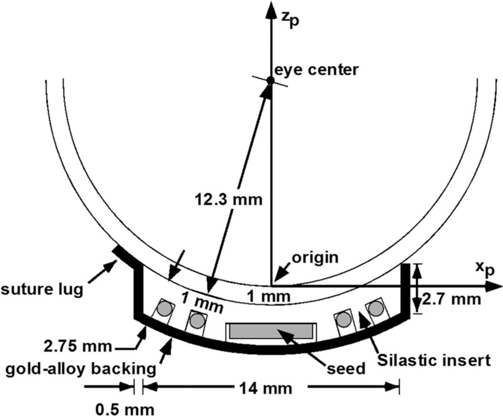

COMS eye plaques
================

The COMS eye-plaques described in AAPM TG-129_ have been implemented in topas-brachy.

The COMS EPs of different diameter are available for simulation::

  EyePlaque10mm
  EyePlaque12mm
  EyePlaque14mm
  EyePlaque16mm
  EyePlaque18mm
  EyePlaque20mm
  EyePlaque22mm

To use them::  

  s:Ge/EP/Type = "EyePlauqe10mm"
  d:Ge/EP/TransX = 2 cm
  d:Ge/EP/RotZ = 90 deg

.. _TG-129: https://aapm.onlinelibrary.wiley.com/doi/full/10.1118/1.4749933