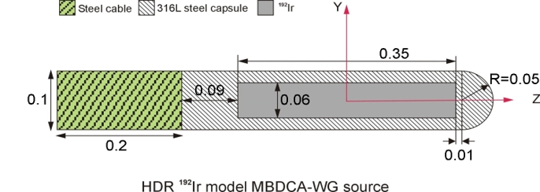

High Dose Rate (HDR) Sources
============================

A common end point of measurement for ...

TG-186 Generic Source
----------------------

The TG186GenericSource component is a generic HDR source model created by AAPM/AGB/... joint 
working group on the commissioning of model-based dose calculation algorithms. 
To create the model specify the component name as well as optional positional paramters as necessary::  

  s:Ge/Source/Type = "TG186GenericSource"
  d:Ge/Source/TransX = 10 "mm"

MicroSelectron HDR Source V2
----------------------------

To create the model specify the component name as well as optional positional paramters as necessary::  

  s:Ge/Source/Type = "MicroSelectronV2Ir192"

VariSource VS 2000 HDR Source
-----------------------------

To create the model specify the component name as well as optional positional paramters as necessary::  

  s:Ge/Source/Type = "VariSourceVS2000HDR"

FlexiSource HDR Source
-----------------------------

To create the model specify the component name as well as optional positional paramters as necessary::  

  s:Ge/Source/Type = "FlexiSourceHDRIr192"

GammaMedPlus HDR Source
-----------------------------

To create the model specify the component name as well as optional positional paramters as necessary::  

  s:Ge/Source/Type = "GammaMedPlusHDR"