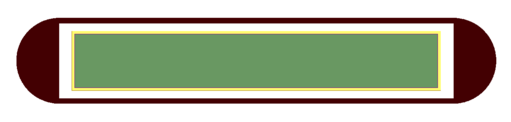

Low Dose Rate (LDR) Seeds
=========================

A common end point of measurement for cells cultured *in vitro* in radiobiology is clonogenic cell survival. Single cell Monte Carlo simulations can provide insight into the total dose received by the cell or the distribution of dose within sub-regions of the cell (e.g., dose to the cell nucleus). This may be correlated with experimental measurements of the loss of a specific function or cell death. Single cell models can also form the geometric boundary for more complex studies, for example, calculating the energy deposited in other sub-cellular components (e.g., organelles, cell membranes) or investigating DNA damage in the nucleus. 

TOPAS-nBio provides users with a unique framework for simulating multiple cell types and the option of including organelle sub-components in the model. 

Amersham, OncoSeed, 6711
------------------------

Source dimensions for the 6711 seed 1,2 are taken from the paper by Dolan et al which presents a more realistic geometry than has been used in previous studies. The 6711 source consists of radioactive AgI and AgBr (2.5:1 molecular ratio of AgI:AgBr and a density of 6.2 g/cm 3 ) coated on a 2.80 mm long cylindrical silver rod with a 0.250 mm radius. The ends of the silver rod are conical sections bevelled at 45.0 o and the end faces of the rod have a radius of 0.175 mm. The radioactive coating is assumed to have a thickness of 1.75 μm over the entire surface of the rod. The silver rod is encapsulated in a 3.75 mm long titanium tube with 0.0700 mm thick walls, a 0.800 mm outer diameter and 0.375 mm thick hemi-spherical end welds. The overall source length is 4.55 mm and the active length is 2.80 mm. The cylindrical source element is free to move 0.475 mm along the seed axis and 0.080 mm radially from the center of the seed.::  

  s:Ge/MyCell/Type="TsSphericalCell"
  d:Ge/MyCell/CellRadius=20 um

Users have the option of including a nucleus. Specify the radius to add the nucleus to the cell::

  d:Ge/MyCell/Nucleus/NucleusRadius=5. um

The nucleus position within the cell can be edited using::

  d:Ge/MyCell/Nucleus/translateX = 0.2 um
  d:Ge/MyCell/Nucleus/translateY = 0.0 um
  d:Ge/MyCell/Nucleus/translateZ = 0.1 um

 
Mitochondria can also be placed randomly in the cell, the size and the number of mitochondria are specified in the parameter file::

  i:Ge/MyCell/Mitochondria/NumberbOfMitochondria=20
  d:Ge/MyCell/Mitochondria/a=0.5 um
  d:Ge/MyCell/Mitochondria/b=0.3 um
  d:Ge/MyCell/Mitochondria/c=0.9 um

A nucleus and mitochondria may be added to any of the cell models listed in a similar manner.

BEBIG GmbH, IsoSeed, I125.S17
-----------------------------

The IsoSeed I125.S17 1,2 source dimensions are taken from the study by Lymperopoulou et al . The source element for the IsoSeed is a cylindrical molybdenum rod with an outer diameter of 0.500 mm and a length of 3.40 mm. The rod is coated with a layer of nickle that is 3.00 μm thick. On top of the nickle is a 25.0 μm thick layer of silver which is in turn coated with a 2.00 μm thick layer of radioactive silver iodide. The titanium encapsulation has a 0.800 mm outer diameter and is 0.0500 mm thick. End welds are 0.400 mm thick and hemispherical in shape. The overall source length is 4.5mm and the active length of the source is 3.46 mm. The cylindrical source element is free to move 0.120 mm along the seed axis and 0.070 mm radially from the center of the seed.:: 

  s:Ge/MyCell/Type="TsEllipsoidCell"
  d:Ge/MyCell/xSemiAxis=20 um
  d:Ge/MyCell/ySemiAxis=10 um
  d:Ge/MyCell/zSemiAxis=15 um
  
  
.. _TOPAS custom scorers readthedocs: https://topas.readthedocs.io/en/latest/extension-docs/scoring.html?highlight=tuple
.. _NeuroMorpho neuron database: http://neuromorpho.org
